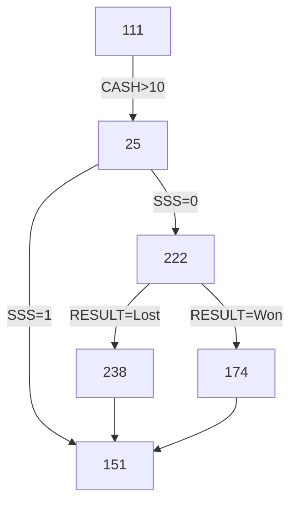

<!--suppress ALL -->

<p align="center">
    <a href="https://www.ninergames.com/" target="_blank">
        
    </a><br />
</p>

<h1 align="center">Jamb Template Repository</h1><br />

This is a template repository that contains information mostly on technical stuff etc. Feel free to rip off this  part 
(or any other in this document) and replace it with actual content about your repository.

- [General tools](#general-tools)
  * [Passwords](#passwords)
  * [Screen share](#screen-share)
- [Developer tools](#developer-tools)
  * [Base64](#base64)
  * [JavaScript](#javascript)
  * [JSON](#json)
  * [Markdown](#markdown)
  * [Website optimization](#website-optimization)
  * [Screen capture](#screen-capture)
- [Diagrams](#diagrams)
  * [Example](#example)
  * [Source code](#source-code)
  * [Tools](#tools)
  * [Other diagram types](#other-diagram-types)
  * [Kroki.io service](#krokiio-service)
- [Releases](#releases)

This in-line ToC has been generated using [GitHub Wiki TOC generator](https://ecotrust-canada.github.io/markdown-toc/).  For details, see [end of this document](#table-of-contents).

# General tools

## Passwords

If we need to generate some random password or key, the [RandomKeygen](https://randomkeygen.com/) service seems to be a great replacement!

It groups generated passwords by the possible usage type:

- Memorable, strong and very strong passwords
- WPA keys (regular 160-bit and 504-bit "monsters")
- WEP Keys (64-bit, 128-bit, 152-bit and 256-bit keys)
- CodeIgniter Encryption Keys (or for any other 256-bit key requirement)

It generates a set of 38 passwords at once. Each of them can be copied by simply clicking it.

## Screen share

If _Google Meet_ or _Microsoft Teams_ are not installed, we can [setup an quick 1-to-1 screen share session on-line](https://www.jitbit.com/screensharing/).

All that is needed is to:

- [Open JitBit's Free Screen Sharing tool's page](https://www.jitbit.com/screensharing/),
- Click _Share My Screen_ and
- Send someone the link

Some remarks:

- This is truly peer-to-peer, no-middle-server connection
- The generated link is valid and works for first two persons using it only
- Third or more person using the link will see an empty screen or will break meeting for everyone

For multi-user screen shares we need old good _Google Meet_ or _Microsoft Teams_.

# Developer tools

## Base64

[Base64.Guru](https://base64.guru/) rules!

- [Encode](https://base64.guru/converter/encode) Base64 from:
    - Strings: [text](https://base64.guru/converter/encode/text), [URL](https://base64.guru/converter/encode/url), [HTML](https://base64.guru/converter/encode/html), [hex](https://base64.guru/converter/encode/hex) and [CSS styles](https://base64.guru/converter/encode/css)
    - Binary: [image](https://base64.guru/converter/encode/image), [audio](https://base64.guru/converter/encode/audio), [video](https://base64.guru/converter/encode/video), [PDF](https://base64.guru/converter/encode/pdf) and any [other file type](https://base64.guru/converter/encode/file)
- [Decode](https://base64.guru/converter/decode) Base64 to:
    - Strings: [text](https://base64.guru/converter/decode/text), [hex](https://base64.guru/converter/decode/hex)
    - Binary: [image](https://base64.guru/converter/decode/image), [audio](https://base64.guru/converter/decode/audio), [video](https://base64.guru/converter/decode/video), [PDF](https://base64.guru/converter/decode/pdf) and [file](https://base64.guru/converter/decode/file)
- [Play](https://base64.guru/tools/):
    - [Validate](https://base64.guru/tools/validator) or [repair](https://base64.guru/tools/repair) Base64 string
    - [Convert data URL](https://base64.guru/tools/data-url-to-image) to image (uri-image) to a file
    - [Normalize](https://base64.guru/tools/normalization) it, to safely sent it via email (MIME) or use as file name or as a part of URL (Base64URL)

Also quick guides on how to work on Base64 in: [Javascript](https://base64.guru/developers/javascript), [PHP](https://base64.guru/developers/php) or how to embed [data-uri](https://base64.guru/developers/data-uri) into a [HTML document](https://base64.guru/developers/html).

## JavaScript

* [ValidateJavaScript](https://validatejavascript.com/): as name says, good and challenging JavaScript linter
* [JSCompress](https://jscompress.com/): strong JavaScript compressor (works on in-line code or uploaded files)

## JSON

- JSONCompare:
    - [One file or doc](https://jsoncompare.com/#!/simple/): beautify, minify, sort, save (for sharing) and lint
    - [Two files or docs](https://jsoncompare.com/#!/diff/): compare
- [JSON Editor Online](https://jsoneditoronline.org/):
    - Edit JSON files in fully WYSIWYG mode with a lot of useful tools
    - Whole JSON or selected part can be edited as: plain text, tree or table
    - Save JSON data to cloud (1 MB limit) or to file, send as URL, export to CSV where possible    
    - [For 3 USD per month](https://jsoneditoronline.org/pricing/) you get add-free and for 6 USD per month you can save private JSONs to the cloud
- [JSON Studio](https://jsonstudio.io/):
    - Is slow and has some bugs, but also has some fabulous features
    - Can minify and format (beautify) JSON with one click (_Others_ button)
    - Tracks history of your edits which can save your ass in some situations
    - Can render JSON as a [graphic tree](https://jsonstudio.io/view/json-crack-viewer) (click _Zoom+_ or _Zoom-_ if nothing seems rendered)
    - Can render JSON as [an expandable table / grid](https://jsonstudio.io/view/json-grid-viewer) (for nested objects has a bug and shows only first column)
    - Can generate [a class diagram of DB structure](https://jsonstudio.io/view/json-db-viewer) (with relations!) to store your JSON in database
    - Can [convert](https://jsonstudio.io/convert/JSON-to-CSV-Converter) between JSON, YAML and CSV both ways (nested objects can't be exported to CSV)
    - Also can [compare two JSONs](https://jsonstudio.io/json-diff-checker) and look for possible differencies
- [JSON Viewer](https://jsonviewer.ai/) can only validate correctness of a JSON and beautify it

## Markdown

GitHub itself has a great Markdown support. But when writing large texts, it is often tiring to constatly swich between editor and preview.

In this case [StackEdit](https://stackedit.io/app#) can be a good replacement:

- Renders Markdown as you type
- Has reach Markdown editor; source colouring and formatting helps editing quicker
- Supports many keyboards (default are weird, but can be overwritten in settings)
- Supports workspaces and folders, allows to work over many files at all
- Can publish documents (as Markdown and HTML) to GitHub, Wordpress, Google Drive, Zendesk and more
- Able to synchronize workspaces accross devices and users using various sync services
- Can import and export Markdown or HTML; export to many formats [through Pandoc](https://pandoc.org/index.html) is limited to paid users
- Has a handy document's table of contents and Markdown cheatsheet
- Supports simple templates for exporting and publishing
- When rendering live, offers full support for MermaidJS diagrams [see below](#example)

This is especially important when editing wiki pages, which seems to be a secondary-citizen to GitHub and most valuable functions (that works in repos and issues) doesn't work here (like no support for keyboard shortcuts etc).

## Website optimization

- Scan your website for [unused CSS selectors](https://www.jitbit.com/unusedcss/) scanner to find all obsolete CSS selectors
- Scan your HTTPS-website [to find any non-HTTPS served images](https://www.jitbit.com/sslcheck/) that may trigger a "mixed content" warning
- This is a website crawler; it starts with provided URL, and then follows all found links recursively to scan all pages

## Screen capture

- **Off-line**: [Microsoft Snip & Sketch](https://apps.microsoft.com/store/detail/snipping-tool/9MZ95KL8MR0L) for images and screen-casts
- Even easier screen-cast capturer, with mouse clicks etc. is [free LICPcap](https://www.cockos.com/licecap/)
- Both produces image files (_.gif_ animations) that can be very easily uploaded to any ticket, page etc.
- Must be installed (can't be used on-line) and can't capture sound along with video
- **On-line**: [JitBit's Screen Capture](https://www.jitbit.com/screencapture/) full on-line video capture tool
- Produces _.webm_ video files which can't be uploaded to many places (i.e. GitHub rejects them)
- Since this is a full video format, it can record screen capture _with sound_ captured from system microphone
- You can convert to _gif_ using [Cloud Convert](https://cloudconvert.com/webm-to-gif), [Convertio](https://convertio.co/webm-gif/), or [Online Coverter](https://image.online-convert.com/convert/webm-to-gif), but this will drop recorded sound

# Diagrams

We can use [MermaidJS tool for JavaScript](https://mermaid.js.org/) across entire GitHub (in [issues](https://github.com/ninergames/test-renpy-engine/issues/23), [discussions](https://github.com/ninergames/test-renpy-engine/discussions/21) and [in text files](https://github.com/ninergames/test-renpy-engine)).

## Example



The `174` item is clickable and points to → [https://mermaid.live/edit](https://mermaid.live/edit).

## Source code

Pure MermaidJS code needed to generate the above diagram is:

```
flowchart TD
    111 --> |CASH > 10| 25
    25 --> |SSS = 1| 151
    25 --> |SSS = 0| 222
    222 --> |RESULT = Won| 174
    222 --> |RESULT = Lost| 238    
    238 --> 151
    174 --> 151
    click 174 href "https://mermaid.live/edit
```

If you don't need clarify in reading, you may minify the above, by replacing new-lines with `;` and removing most spaces:

```
flowchart TD;111-->|CASH>10|25;25-->|SSS=1|151;25-->|SSS=0|222;222-->|RESULT=Won|174;222-->|RESULT=Lost|238;238-->151;174-->151; click 174 href "https://mermaid.live/edit"
```

Resulting in a nice one-liner. Which you can put anywhere you wish (issue, discussion, wiki):

    ```mermaid
    flowchart TD;111-->|CASH>10|25;25-->|SSS=1|151;25-->|SSS=0|222;222-->|RESULT=Won|174;222-->|RESULT=Lost|238;238-->151;174-->151; click 174 href "https://mermaid.live/edit"
    ```
## Tools

- At <https://mermaid.live/edit> there's an on-the-fly editor which render MermaidJS code as you type it
- Use [mermaid.ink Generator](https://mermaid.ink/) to "convert" (render) MermaidJS code it into an image and data-uri string.

## Other diagram types

- [Class Diagram](https://mermaid.live/edit#pako:eNptkc9OwzAMxl8l8glE-wIVF8SYxGGn3aZKyE28LmrijPzRBGPvTlrWMDZySfyzP-uLfQTpFEED0mAIC429R9uyyOeJtUUjHr_qWiySHG7pUofdLd1Q5_EPbsSD5iiwp2u8jl5zL3piRf4yOUrCCm1-3t1fJSxGmuFke7J3_AGiNO0Ih2dnnC-JcNB2FubwPaEc5vh02W_8WOlXj96D_qRXXhLFgiXyC8Z_9dMIfg11zhmhw9tBG1WgT1y0UIElb1GrvIlJ10LckaUWmvxUtMVkYgstj6WYolt_sIQm-kQVpL3KEznvboakdHR-dV7ueFWwR944l0u2aAKdvgFIMZyC)
- [Sequence Diagram](https://mermaid.live/edit#pako:eNptkLFqAzEMhl9F0VrfC9yQUujQFDp1K16E_V_OYFuJY1NCyLvXd9ds0fQjfZ9AurFTDx75gnNDdngPciySbKZebzE4DPv9y6fOeaQPxKi0ZEOz_pIU0FXb61N4w5zkBaEZUijhH11mQ0eH1emLw2YbOqzGSndt9xw_0AREOhZI3bHhhJIk-H7FbREs1xkJlscePSZpsVq2-d5RaVW_r9nxWEuD4XbyUh9HP5rwoWr52h6z_sfwSfKPakcmiRfc_wC26mTi)
- [Simple State Machine Diagram](https://mermaid.live/edit#pako:eNpdjz0LgzAQhv-K3Fh06ejQpV2d3No4HObUQD4kXoQi_vemCdJipofn3gv3btA7SVDDwsj0UDh6NNV6FbaI73Xpiqq6FS0rrbNKmGQcnlXjVmXHbDOf1__s3eMyZZvw-BRKMOQNKhnP2r4BATyRIQF1REkDBs0ChN1jFAO79m17qNkHKiHM8lfkkCQVO9_kpqlwCTPap3MxMqBeaP8ArztTOA)
- [Entity Relation Diagram](https://mermaid.live/edit#pako:eNp10VFrgzAQB_CvEu5Z-wF8KxqGMOeIttCRl8ycbUCNpLEw1O--WA1bO5a3HL_7J9yNUGmJEAGaRImzES3viDvxoSjzjDIyT7vdNJKEvqZHyk7hPkkYLQoSkYu4PtlpCkM9kpwl7hKRvhEV_mPSt2OextQpDo0Snw2SWhsOq_7z2lOywQrVzWf7rAVNP6jSNzQbWWu_QZiWNHNKdVUzSB_1zvLkEJdhvC_pS85OvmWr31M7K1T36B_-55M5aCPRoHRvcIAAWjStUNINe1y6OdgLtshhoRJrMTR2GcDsqBisLr66CiJrBgxg6KWwuG3IF1Eqq0227u--xgB60X1o7UgtmivO35Pxk64)
- [User Journey Diagram](https://mermaid.live/edit#pako:eNplULEKg0AM_ZWQ2aWULrdW6OTkVlyCl9arepEzR5HSf--pFSzNFN57eY-8F9ZiGQ0-JAbPU-UhjTrtGIoJnhJa5-9g6cuMXKsTDxcBlYVecYCCWgZlMnAyUPAGJ2EcRiUXRgPHPZOv9wYOM5rBmfQvo5F-72Tl6Tevn5TS6UJ-IzDDnkNPzqbPXrOoQm04eaFJq-UbxU4rrPw7SSmqlJOv0WiInGEcLCnnju6B-g1k61RCsZa1dJbhQP4qkiQ36kZ-fwCt22h_)
- [Pie Diagram](https://mermaid.live/edit#pako:eNo1j8sKwjAQRX8lzLobEaVka7eC6E6yGZtpDeRFMhFK6b8bLZnV5XDg3llhDJpAQjQk2LAlcSPOAnWITFq8FvEJtngmSll5UU_BEOasQEhx7M-NXZB31p8aujd0OEEHjpJDo2vV-hMU8JscKZA1apqwWFag_FZVLBweix9BcirUQYkamQaDc0LXIGnDIV339f8nOojonyFUZUKbafsCDfBG3g)

The [User Journey Diagram](https://mermaid.live/edit#pako:eNplULEKg0AM_ZWQ2aWULrdW6OTkVlyCl9arepEzR5HSf--pFSzNFN57eY-8F9ZiGQ0-JAbPU-UhjTrtGIoJnhJa5-9g6cuMXKsTDxcBlYVecYCCWgZlMnAyUPAGJ2EcRiUXRgPHPZOv9wYOM5rBmfQvo5F-72Tl6Tevn5TS6UJ-IzDDnkNPzqbPXrOoQm04eaFJq-UbxU4rrPw7SSmqlJOv0WiInGEcLCnnju6B-g1k61RCsZa1dJbhQP4qkiQ36kZ-fwCt22h_) can be also used for example, to denote results of some poll etc.

## Kroki.io service

We can use this service for:

- All other diagram types that MermaidJS doesn't support
- All diagrams that for some reason we want to generate in other language than MermaidJS
- All diagrams that in some scenario we need to use as a static image instead of editable code

Some other diagrams (not available in MermaidJS) that are worth considering includes:

- [Syntax diagram in Pikchr](https://kroki.io/examples.html#syntax)
- [Container diagram in C4 PlantUML](https://kroki.io/examples.html#c4-container) (for drawing system architectures)
- [Component diagram in C4 PlantUML](https://kroki.io/examples.html#c4-component) (can be used for drawing nearly everything)
- [MindMap diagram in PlantUML](https://kroki.io/examples.html#mind-map) (looks better than the one generated in MermaidJS)

And many more. Kroki.io supports [20+ languages](https://kroki.io/#support) and for certain languages (but not for MermaidJS) it allows rendering diagrams in PDF or TXT formats or as base64-encoded streams.

# Releases

All the details are given in [Git Basics - Tagging](https://git-scm.com/book/en/v2/Git-Basics-Tagging) and [Managing releases in a repository](https://docs.github.com/en/repositories/releasing-projects-on-github/managing-releases-in-a-repository).

In short:

1. Make a tag:
    * For exiting commit:
        * List all commits: `git log --pretty=oneline`
        * Pick the one you wish to tag (first seven letters of the has are enough), i.e.: `32c274c`
        * Add a tag: `git tag -a 0.1 32c274c -m "First version before general refactor"`
    * For latest commit: `git tag -a 1.4 -m "My version 1.4"`
    * Please, **do not** use `v1.0` scheme;
        * A version is a version, no need to prepend number with `v`
        * Even if [GitHub claims](https://github.com/akademia-slaska/template-repository/releases/new) that this is a common practice to do so
    * Use [Semantic Versioning 2.0.0](https://semver.org/) (three numbers) whenever possible
2. Push tag(s) to GitHub: `git push --tags`
3. Create [a new release](https://github.com/akademia-slaska/template-repository/releases/new): pick a tag, add title and a description, add some binaries, set options
4. Publish a release or save it as a draft.

GitHub **always adds a source code** to release. We **must always treat** all our releases **purely as private**.

Note that `git push --tags` pushes tags **only**. If you have some unpushed commits in the same time, you should send them next, using regular `git push`.
